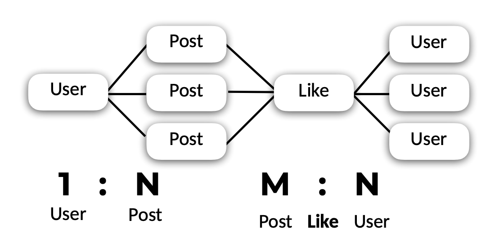

# 1차 과제
## 과제 설명

- 데이터베이스 테이블 설계해보기
- User 테이블 에는 id(인덱스),name, email, password, salt컬럼이 있다
- Post 테이블에는 id(인덱스), author, title, contents, createdAt, updatedAt 컬럼이 있다.
- 모든 user는 모든 post에 좋아요를 누를 수 있다. 
   

   

## User
| column | type | 
|---|--|
|id | int(11) unsigned|
| name| varchar(50) |
| email | varchar(50) |
| password | varchar(100) |
| salt| varchar(100) |

   

## Post
| column | type | 
|---|--|
|id | int(11) unsigned|
| author| int(11) unsigned |
| title | varchar(100) |
| contents | text |
| createdAt | varchar(20) |
| updatedAt| varchar(20) |

   

## Like
| column | type | 
|---|--|
| id | int(11) unsigned|
| post_id| int(11) unsigned |
| user_id | int(11) unsigned |

